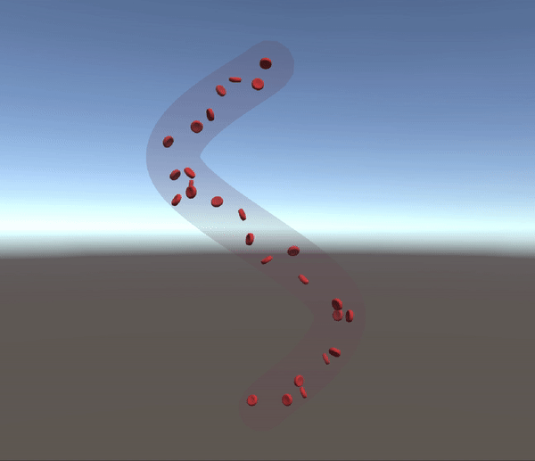

# WenyuMao_BloodFlow

Modify points under "Spline" to customize the bloodflow

Bloodflow Controller: 
Cell Amount: number of cells in the bloodflow in total. 
Speed: the speed of the blood flow. 
Density: the distance between blood cells. 
Cell Color: the color of the cell objects. 
Vessel Color: the color of the vessel. 
Cell prefab: prefab of the cell with scripts attached on it. 
Spline Root: reference to the spline object in the scene. 
Wrap Mode: loop the movement or not. 
Autoclose: if the spline is a loop. 
Look At Destination: the orientation of the blood cells.

Please note: Settings should be modified before running.
